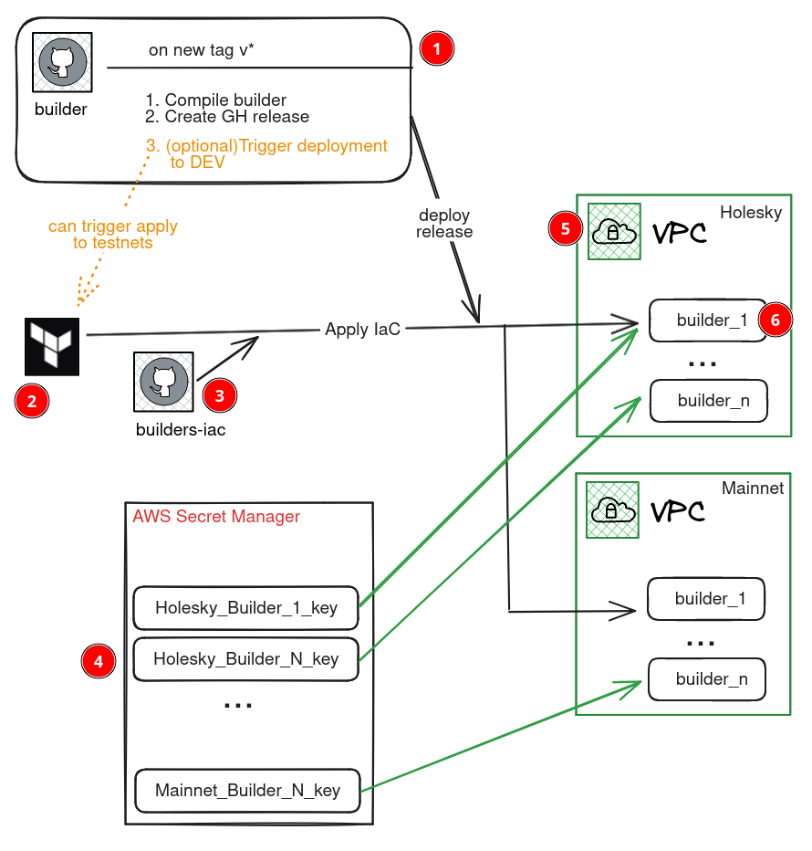

# Terraform workspaces of flashbots builder instances.
Terraform workspaces deploing [Builder releases](https://github.com/ManInWeb3/flashbots-builder/releases) as AWS EC2 instances.

## Release and Deploy architecture.

1. Builder’s GitHub repo, with configured [GitHub action to compile the code and create a new release with the binary](https://github.com/ManInWeb3/flashbots-builder/blob/deneb/.github/workflows/release.yml).  
  **Trigger:** on new **v*** tag  
  **Artifacts:** archived binaries  
2. Terraform Cloud workspaces configured to apply [builders-iac](https://github.com/ManInWeb3/flashbots-builders-iac/) terraform code.  
  **Trigger**: manual, or can be trigger with GitHub action in (1)  
  **Artifacts**: VPC, Security groups and builders  
  **Dependencies**: Builders’ secret keys (4) must be created manually.  
3. [Builder’s Infrastructure as Code GitHub repo](https://github.com/ManInWeb3/flashbots-builders-iac/).
4. Builders’ secret keys saved in AWS Secret manager.
5. [Builders’ common infrastructure terraform code](https://github.com/ManInWeb3/flashbots-builders-iac/tree/main/holesky/CommonInfra): AWS VPC, Security groups, …  
  *Common infra IaC separated from Builders’ Ec2 instances IaC to :  
  a) decrease the possibility of a mistake, eg. rename VPC will force re-creation of the whole infra and disruption in the service.  
  b) Make infra more flexible, we can use the same VPC for all the networks etc.*  
6. [Builders’ EC2 instances terraform code](https://github.com/ManInWeb3/flashbots-builders-iac/tree/main/holesky/Builders): 
  * Create EC2 instances
  * AWS Session manager IAM roles
  * Security group to setup egress/ingress rules
  * IAM roles to read secret keys.  
  *Builders secret keys are read with [the instances user_data script](https://github.com/ManInWeb3/flashbots-builders-iac/blob/main/modules/Builders/files/user_data.sh.tftpl#L71), so not saved in terraform state.  
  In the current implementation SECRET name matches with the INSTACE name, this is done for the sake of simplification, so you always know the builder to secret relation. IAM role allows each instance [to read only secret key with the same name](https://github.com/ManInWeb3/flashbots-builders-iac/blob/main/modules/Builders/main.tf#L70).*

## Structure of the repo:
* modules/ - folder with required modules
* holesky/, mainnet/ - folders with Terraform workspaces to deploy builders on Ethereum HOLESKY and MAINNET.
  * CommonInfra - workspace to deploy pre-requsits of the **holesky/Builders** workspace.
  * Builders    - workspace to deploy builder EC2 instances.

### holesky/, mainnet/ Builders
These workspaces create:
* EC2 instances configured in [builder_instances](https://github.com/ManInWeb3/flashbots-builders-iac/blob/main/holesky/Builders/main.tf#L38)
* [data_volume_size](https://github.com/ManInWeb3/flashbots-builders-iac/blob/main/holesky/Builders/main.tf#L8) Gb Data volume for each instance. Data operations are not implemented.
* Configure AWS session manager to be able to access the instance console.
* Security group to configure any required ingress and egress rules.

### holesky/, mainnet/ CommonInfra
These workspaces create resources required with **holesky/, mainnet/ Builders** workspaces, so should be deployed first. They will deploy the following resources:
* VPC network
* Subnetworks
* VPC endpoints to configure [Session manager](https://docs.aws.amazon.com/systems-manager/latest/userguide/session-manager.html) access.

## Deploy a new release
1. Change the value of [builder_release](https://github.com/ManInWeb3/flashbots-builders-iac/blob/main/holesky/Builders/main.tf#L15) to the tag you want to deploy.
2. Plan and apply the terraform cloud workspace [builders-holesky-Builders](https://app.terraform.io/app/XXX/workspaces/builders-holesky-Builders).

### Pre-requisits
1. Befor deploing the instances, you need to deploy [CommonInfra](https://github.com/ManInWeb3/flashbots-builders-iac/tree/main/holesky/CommonInfra)
2. Create secret keys for each instance, will be passed as BUILDER_TX_SIGNING_KEY environment variable. **NOTE:** Name of the instances must match with the secret name to run builder with.
3. If ssh_key_name is given, you will be able to access instances via SSH. The key must be created before applying.

## Possible next steps:

1. Automatically deploy new [Builder releases](https://github.com/ManInWeb3/flashbots-builder/releases) to testnets. Probably mainnet should be not that far automated, to prevent disruptions. [Draft is comented out currently](https://github.com/ManInWeb3/flashbots-builder/blob/deneb/.github/workflows/release.yml#L73)
1. Rotate logs on the instances.
2. Refactor user_data script:
    1. Use functions to make it more readable
    2. 
